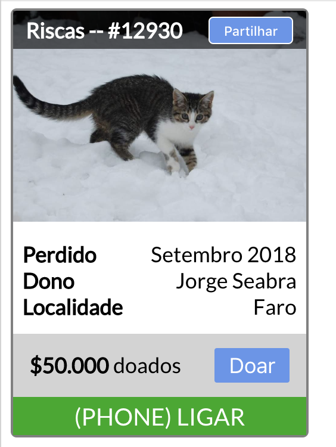

# Dengun Frontend Exercise Level 1

## Let's find the cat!
See here [joaaoeu.github.io/dengun-frontend-exercise-level1](https://joaaoeu.github.io/dengun-frontend-exercise-level1/).

## Run
Run `npm i` then `npm start`

## Build
Run `npm run build`

## Deploy to Github Pages
Run `npm run deploy`

# The Exercise

## Front-end Exercise Level 1 "Let's find the cat"

### Requirements
- Don't use external libraries, neither *scripts* or *stylesheets*. This restriction also applies to "CSS reset" files and "jQuery".
- Use external files for *style rules* and *scripts*
- Don't use `sandbox` apps such as Codepen, Codier, JSBin, ObservableHQ, etc.

### Expected behavior
  - Click on the button with the text "doar" (donate)  - show an "alert box" with the message "Thank you for your donation!"
    - Extra: Change the button text to "Já doou" (donated)
    - Extra extra: change the button style after donation
  - Click on 'ligar' - call a phone number

### Exercise Notes
- The card doesn't need to have a fixed height. Its height can be stipulated by its content

### Assets
- Use the external source http://placekitten.com/960/690 for image.

# License

This project is licensed under the MIT License - see the [LICENSE.md](LICENSE.md) file for details.
